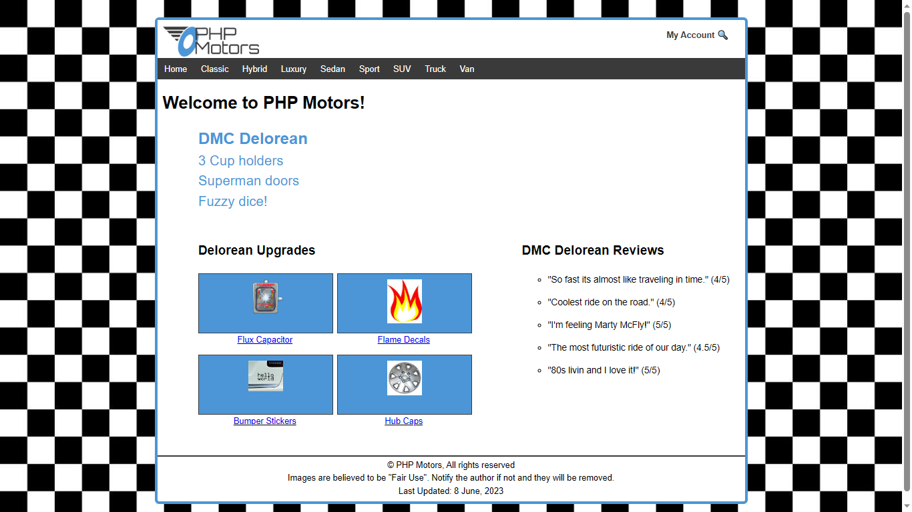

# CSE 340
This repository is based on my personal assignemnts and lessons on Web Backend Development 1 (CSE 340) at Brigham Young University - Idaho

## Yea, Pretty Cool Course
---
I learned much about PHP, i implemented what i learned pretty well, it was challenging but exciting. 

## Instructor
```
*Daniel Stephenson
```

## Author
```
*ThankGod Andrew (and22046@byui.edu)
```


